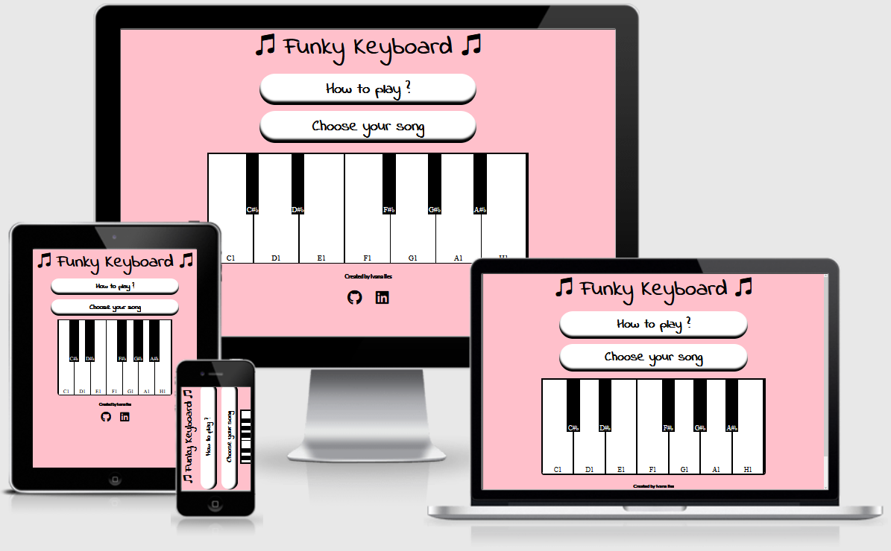
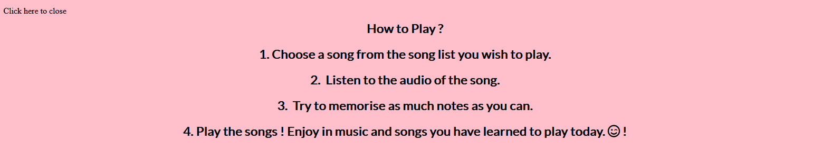
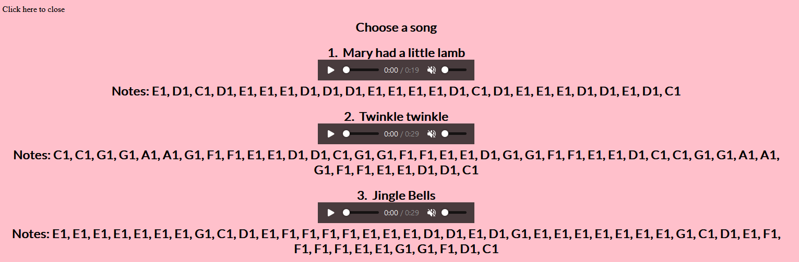
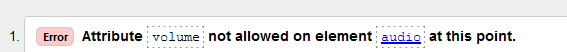
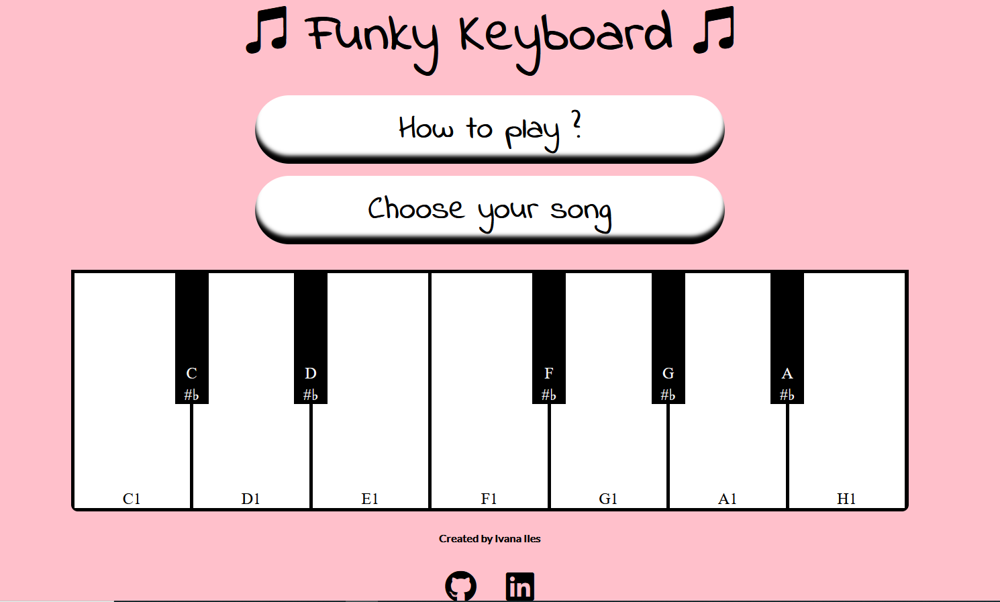
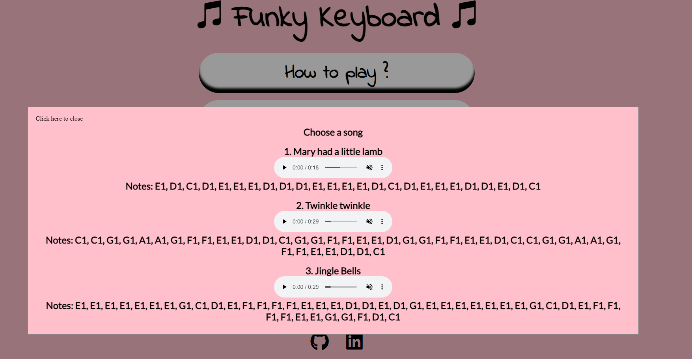

# Funky Keyboard
Funky Keyboard is a website for anyone who wants to learn how to play simple piano songs on the piano keyboard. No previous knowledge is required.
Users can find all the information on this Website about the Funky Keyboard: How to play ?, Choose your song and contact Information of the page author.
You can access the website [here](https://ivana505.github.io/funky-keyboard/).

## Features
- How to play ? 
    - Includes instructions on how to play the keyboard.
    - Text is visible and easy to understand.

- Choose your song
     - User can choose a song from the list and click on the audio to hear it first.
     - Audio helps user to hear the beat and tempo of the song.
     - User can try and memorise as much keys as possible and try to play the song.

- Created by
     - User can get in touch with the author of this Website.
     - User can find more Information about the author.

- Social media links
     - User can get in touch with the author of this Website.
     - User can find more Information about the author.

# User Experience

## Goals

### Visitor goals

The target audience are kids and parents who want to play the piano keyboard without previous knowledge and have fun:

- To understand how the keyboards is played and to navigate through the site easily.
- To learn how to play easy songs on the piano keyboard in a day.
- To hear the songs first before starting to play.

### User Goals

As a user I would like to:

- Play at least 10 different songs.
- hear songs before I start to play.
- See metronome so I can set a speed and follow the beat while I play.
- Learn how to play the piano.
- See lyrics of the songs.
- Be able to record songs I played.

## Design Choices

Font choices

I have decided to use [Google Fonts](https://fonts.google.com/). 
 - Two font styles: Indie Flower for main headings and buttons and Lato for paragraphs.
 - These two font styles complement each other really well. Indie Flower is a handwriting font while Lato is part of a sans serif typeface family.
 - I have included example of the style below: 

 Indie Flower font-family
    
 Lato font-family
    

Icons

- Social Media Icons [Github](https://www.github.com/) and [LinkedIn](https://ie.linkedin.com) are centered and added to the bottom of the page where user will be able to find further Information about me. 
- [Fontawesome](https://fontawesome.com/) was used to add social media icons and smiley face in the "How to play ?" section.

## Color scheme and styling

 - I have decided to use 4 color combination scheme for the page: pink, red, black and white.
 - Background color of the page is pink. Black color is used for headings and black and white combination for the piano keyboard.
 - Red is used as a notification that the key has been pressed.
 - Buttons and modal are styled with further colors and opacity of the black color.
Note colors below : 

## Audio Used

 - I have recorded audio on [Apronus.com Website](https://www.apronus.com/music/flashpiano.htm) which gives option to record your own songs played.

## Wireframes
All wireframes are created with [Balsamiq](https://balsamiq.com/) during the Scope Plane part of the design and planning process for this project.

Landing page

How to Play ?

Choose a song

## Testings

### Validator testing and browser compatibility
- I have tested HTML5 code with - [HTML5 validator](https://validator.w3.org/), first testing showed errors.

- I have tested CSS3 code with  - [Jigsaw validator](https://jigsaw.w3.org/css-validator/#validate_by_uri) and no errors have been found.

- I have tested JavaScript code with  - [JSHint validator](https://jshint.com/), first testing showed errors.

### Browser compatibility
- I can confirm that I have tested website on four different Web Browsers and that the page if compatible:

Landing page [Google Chrome](https://www.google.com/chrome/)

Modal How to play ? [Mozilla Firefox](https://www.mozilla.org/en-US/firefox/new/)

Modal Chioose your song[Brave](https://brave.com/)

- Accessibility 
      - I have confirmed that the Website is accessible by inspecting it in Lighthouse on the [Google Chrome](https://www.google.com/) Dev tools.
    
Result for desktop 
 - Performance for the desktop version 

Result for mobile devices
- Performance for mobile devices 

### Bugs

#### Solved
- Audio did not play due to the incorrect path. Issue has been fixed.

#### Unsolved bugs
During the regular check up of the Webpage I have noticed favicon.com error. 
When investigating with our Slack community I have tried to fix the issue by adding favicon.ico to my website and adding link href (`<link href="./readme/favicon.ico" rel="icon" type="image/x-icon">`)to head of html but it did not fix it.
I have also tried to follow reccommendations from [Github](https://github.com/) Community [here](https://github.community/t/i-have-no-idea-what-the-interest-cohort-is/179780/8) but nothing seem to fix this bug.

## Deployment

The site was deployed to Github pages using following steps: 
   - Login to Github and go into repository Ivana505/funky-keyboard
   - Click on settings and scroll down to Pages section on the page
   - Under the source heading select the master branch option and click save
   - The project has now been deployed and wait for approximate 10 minutes for the link to become active
   - Refresh the page and click on the link to view the live site
  

The live site can be previewed [here](https://ivana505.github.io/funky-keyboard/)

### Local Deployment

In order to make a local copy of this repository, you can type the following into your IDE Terminal:

- `git clone https://github.com/Ivana505/funky-keyboard.git` 

Alternatively, if using Gitpod, you can [click here](https://gitpod.io/#https://github.com/Ivana505/funky-keyboard) to create a new workspace under your account.
  
  # Languages and technologies used
- [HTML5](https://en.wikipedia.org/wiki/HTML5)
- [CSS3](https://en.wikipedia.org/wiki/CSS)
- [JavaScript](https://en.wikipedia.org/wiki/JavaScript)
- [Github](https://github.com/)
- [Git](https://git-scm.com/)
- [TinyPNG](https://tinypng.com/)

## Credits and Acknowledgements

- Image source:
 - [Pixabay](https://pixabay.com/vectors/music-note-music-note-musical-notes-1967480/)

- Audio source:
 - [nemo0 Github](https://github.com/nemo0/js-piano) sounds for the keys.
 - [Apronus](https://www.apronus.com/music/flashpiano.htm)

- Social Media sources:
- [YouTube channel freeCodeCamp.org](https://www.youtube.com/watch?v=F3odgpghXzY) for more Information about addEventListeners.
- [YouTube channel Web Dev Simplified](https://www.youtube.com/watch?v=vjco5yKZpU8) for guidaline how to create a piano keyboard with JavaScript.

  Other sources
  - [Favicon](https://www.favicon.cc/)
  - [Coolors](https://coolors.co/)
  - [Fontawesome](https://fontawesome.com/) for Social Links icons.
  - [TinyPNG](https://tinypng.com/)
  - [W3 Schools](https://www.w3schools.com/howto/howto_css_modals.asp) helped me with creating modal box.
  - [Developer Mozilla](https://developer.mozilla.org/en-US/docs/Web/CSS/CSS_Properties_Reference)
  - [Stack Overflow](https://stackoverflow.com/questions/50229293/get-id-of-clicked-element-vanilla-js) to get ID of clicked element in JavaScript.
  - [Favicon](https://www.favicon.cc/)
  - [Balsamiq](https://balsamiq.com/)
  - [Google fonts](https://fonts.google.com/)
  - [Yoksel.Github](https://yoksel.github.io/grid-cheatsheet/)
  - [CSS tricks](https://css-tricks.com/snippets/css/complete-guide-grid/)
  - [Code pen](https://codepen.io/Fibonaccifreak/pen/VwbQNNJ) helped me to align black keys evenly.
  - [Code pen Js piano](https://codepen.io/Fibonaccifreak/pen/VwbQNNJ)
  - [Web development guide](https://www.thewebdeveloperguide.com/javascript-get-data-attribute/#:~:text=Using%20Javascript%20Get%20to%20a%20Data%20Attribute%20using,its%20id%20using%20the%20Javascript%20document.getElementById%20function.%20) get Data Attribute Information.
  - [Getcssscan](https://getcssscan.com/css-buttons-examples) used for button styling.
  - [HTML and CSS freeformatter](https://www.freeformatter.com/html-formatter.html) to beautify the code.
  - [Code beautify for Javascript](https://codebeautify.org/jsviewer) to beautify JavaScript code.
  - [Am I reponsive](http://ami.responsivedesign.is/) To show responsiveness of the Website.
  - [Audio recorded](https://www.apronus.com/music/flashpiano.htm)

  I want to say thank you to my Mentor Tim for the guidance and tutor support.

### Content
 - Content was created intentionally for the purpose of this project and this Website. Credits go to the creater of the Website.

